# Born2beroot 42 ガイド

## はじめに

Born2berootは、仮想化とサーバー管理の世界への入門を目的としています。
このborn2berootガイドでは、VMの作成とOSのインストールから、サービスのインストールとルールの実装まで、プロジェクト全体を段階的に説明します。

## 目次

1. [仮想マシンの作成](#vmcreation)
    1. [ハイパーバイザー](#hypervisor)
    2. [Linuxディストリビューションの選択](#choosing-the-linux-distribution)
    3. [始めましょう！](#lets-begin)
2. [オペレーティングシステムのインストール](#operating-system-installation)
    1. [起動](#booting-up)
    2. [パーティショニング](#partitioning)
3. [SSHの設定](#setting-up-ssh)
4. [ファイアウォール](#firewall)
5. [sudoとグループ](#sudo-and-groups)
    1. [sudo](#sudo)
    2. [グループ](#groups)
6. [パスワードポリシー](#password-policy)
7. [監視スクリプト](#monitoring-script)
    1. [スクリプトの作成](#writing-the-cript)
    2. [Cronジョブ](#cron-job)
8. [Wordpressの設定](#setting-up-wordpress)
    1. [パッケージのインストール](#packages-installation)
    2. [ファイアウォールとPHPの有効化](#firewall-and-enabling-php)
    3. [ポートフォワーディング](#port-forwarding)
    4. [データベース](#database)
    5. [まとめ](#putting-things-together)
9. [追加サービス](#additional-service)
    1. [何を選ぶか？](#what-to-choose)
    2. [Netdataの設定](#setting-up-netdata)
10. [署名とスナップショット](#signature-and-snapshots)
11. [その他](#miscellaneous)

---

### <a name="vmcreation">仮想マシンの作成</a>

#### <a name="hypervisor">ハイパーバイザー</a>

まず、仮想マシンを作成するためにハイパーバイザーが必要です。

ハイパーバイザーには2つのタイプがあります:

<b>タイプ1 (ベアメタル):</b>
これらはホストのハードウェア上で直接実行され、最適化されたリソース割り当てを容易にします。人気のある例としては、VMWare ESXi、Microsoft Hyper-V、Proxmoxがあります。これらはサーバー環境で使用されます。

<b>タイプ2 (ホスト型)</b>:
これらは既存のオペレーティングシステムの上に追加レイヤーとして動作し、仮想マシンの管理とアクセス性を簡素化します。VirtualboxやVMware Workstationについてよく耳にするでしょう。これらはPCで使用されます。

このborn2berootガイドでは、プロジェクトの要件に従い、オープンソースのタイプ2ハイパーバイザーであるVirtualboxを使用します。

#### Linuxディストリビューションの選択

Linuxディストリビューションには、Rocky LinuxとDebianの2つの選択肢があります。Rocky Linuxは、現在廃止されたCentOSの後継を目指しており、サーバー向けの堅牢で信頼性の高いプラットフォームを提供します。一方、確かな安定性で知られる堅実なDebianは、Ubuntuの基盤としても機能します。

おそらくシステム管理に慣れていないことを考えると、DebianはサーバーとPCの両方にとって良い選択です。

#### 始めましょう！

まず、最新のDebianのISOイメージを取得する必要があります。[Debianの公式サイト](https://www.debian.org/distrib/netinst)から"amd64"を選択して入手できます。

Virtualboxを開き、「新規」をクリックします。仮想マシンに名前を付け、ダウンロードしたISOイメージを選択し、データの保存場所を選択します。もし42 Parisにいる場合、ホームディレクトリは5 GB、sgoinfreは30 GBに制限されているため、外付けドライブを使用するか、sgoinfreに保存することを検討してください。次のステップに進む前に、「無人インストールをスキップ」にチェックを入れていることを確認してください。

次に、仮想マシンにリソースを割り当てましょう。少なくとも4 GiBのRAMと2つのvCPUコアを割り当てることをお勧めしますが、パフォーマンス向上のために私は8 GiBのRAMと8つのvCPUコアを使用しました。

ストレージについては、10 GiBで十分ですが、私は20 GiBを選択しました。「ディスク全体を事前に割り当てる」にチェックを入れてください。

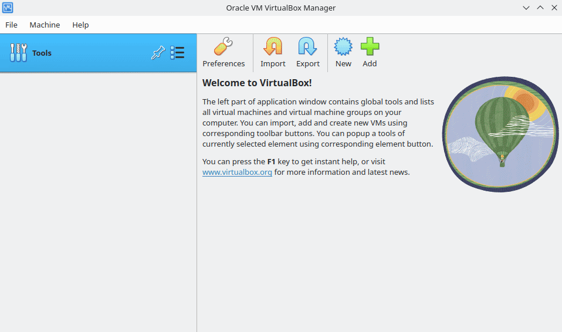

---

### オペレーティングシステムのインストール

#### 起動

仮想マシンの準備ができたので、次のステップは、通常のコンピュータと同じようにオペレーティングシステムをインストールすることです。

Virtualboxインターフェースで「起動」をクリックします。「Install」を選択し、画面の指示に従います。インストールプロセスは、ArchやGentooのようなより複雑なディストリビューションと比較して非常に簡単です。もしそれらをインストールしようとしたことがあるなら、Debianは著しく簡単だと感じるでしょう。

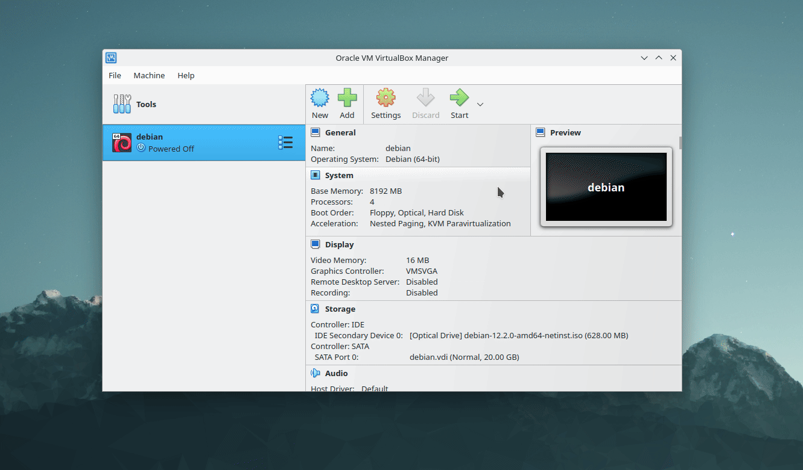

プロジェクトのガイドラインで要求されているように、ホスト名をあなたのログイン名に42を続けたものに設定します。これはローカルネットワーク上でのあなたのデバイスの名前です。
ドメイン名の設定はスキップします。rootのパスワードを設定します。あなたのログイン名でユーザーを作成し、このアカウントのパスワードを設定します。

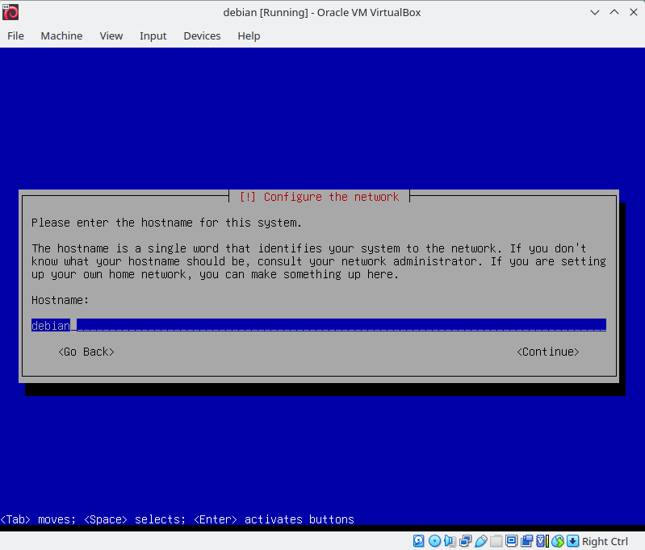

#### パーティショニング

ディスクをパーティション分割する時が来ました。「ガイドに従う - ディスク全体を使い、暗号化LVMをセットアップする」を選択し、次に「/home、/var、/tmpパーティションを分離する」を選択します。この設定は、born2berootのボーナスパートを完了するために重要です。

パスワードを設定します。これにより、たとえ警察が私の家を家宅捜索しても、私の（非常に弱い）パスワードを破らない限り、私のデータにアクセスすることはできません。🥸

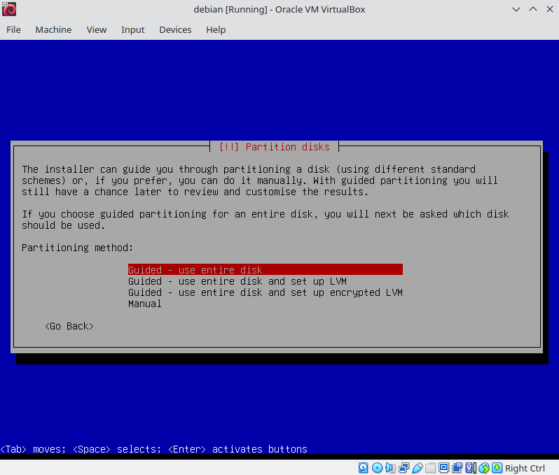

ガイド付きパーティショニングでボリュームグループサイズを調整し、さらにいくつかの論理ボリューム用のスペースを確保します。
「論理ボリュームマネージャの設定」に進み、``srv``と``var-log``という2つの論理ボリュームを作成します。
両方を「Ext4ジャーナリングファイルシステム」として設定し、それぞれ``/srv``と``/var/log``にマウントします。

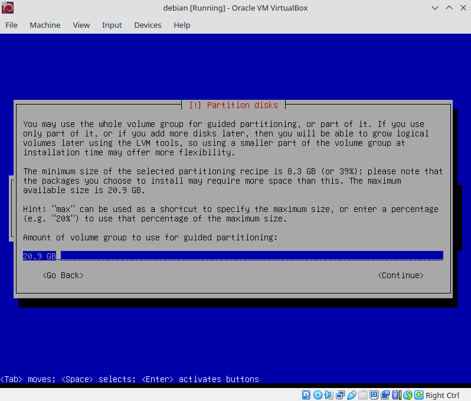

追加のインストールメディアのスキャンは避けてください。デフォルトのDebianアーカイブミラーを選択し、プロキシ設定は空のままにします。パッケージ利用状況調査への参加は選択しないでください。GRUBローダーをインストールするようにしてください。

最後に、ソフトウェアの選択に関しては、「SSHサーバー」と「標準システムユーティリティ」のみを選択します。スペースキーでチェック/アンチェックします。これでインストールは完了です。仮想マシンを再起動して、このborn2berootガイドの残りの部分を探索し始めましょう。

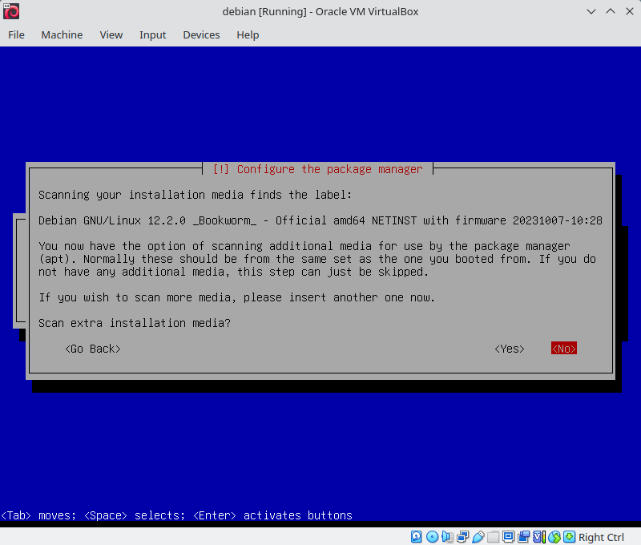

---

### SSHの設定

サーバーにログインできるようになりましたが、リモートでアクセスしたい場合はどうすればよいでしょうか？SSHを設定する時が来ました。

rootとしてログインし、SSHサービスのステータスを確認します: ``systemctl status ssh``

出力は、SSHサービスがアクティブであり、デフォルトポート22で実行されていることを示すはずです。Born2berootでは、SSHサーバーをポート4242で実行する必要があります。これを行うには、``/etc/ssh/sshd_config``にあるSSH設定ファイルを編集します。お好みのテキストエディタでファイルを開きます。``Port 22``を``Port 4242``に変更し、``PermitRootLogin``を``no``に設定します。変更を加えた後、行のコメントを解除することを忘れないでください。

完了したら、SSHを再起動します: ``systemctl restart ssh``

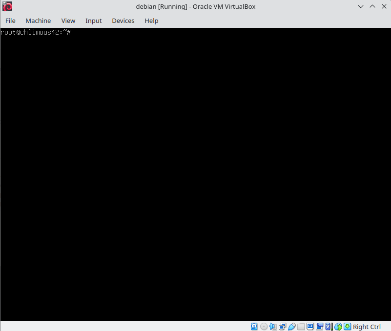

次に、Virtualboxでポートフォワーディングを設定します:

仮想マシンの設定に移動し、ネットワーク、次に詳細設定、最後にポートフォワーディングに移動します。
「SSH」という名前の新しいルールを作成します。このルールは、利用可能なホストポートをゲストポート4242にリダイレクトする必要があります。42 Parisではポート22は利用できないため、ホストポートとしてポート2222を使用しました。

ポートフォワーディングが設定されると、Virtualboxはホストマシンのポート2222でのリクエストをリッスンし、これらのリクエストをゲストマシンのポート4242に転送します。これにより、ホストシステムから仮想マシンへのSSHアクセスが可能になります。

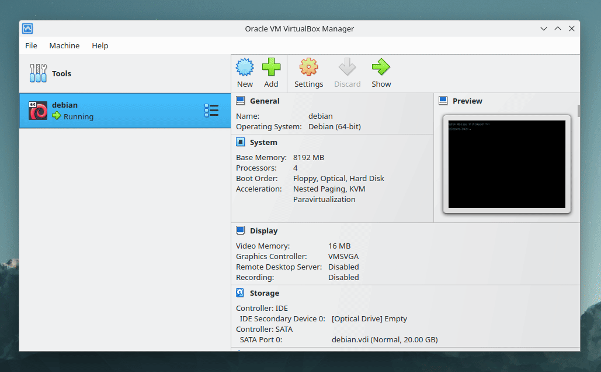

これらの手順が完了すると、SSH経由で仮想マシンに接続できるようになるはずです。

仮想マシンからログアウトします: ``logout``

次に、ホストのターミナルで次のように入力します:

``ssh chlimous@localhost -p 2222`` | ユーザー``chlimous``をポート``2222``経由で``localhost``マシンにSSH接続します。

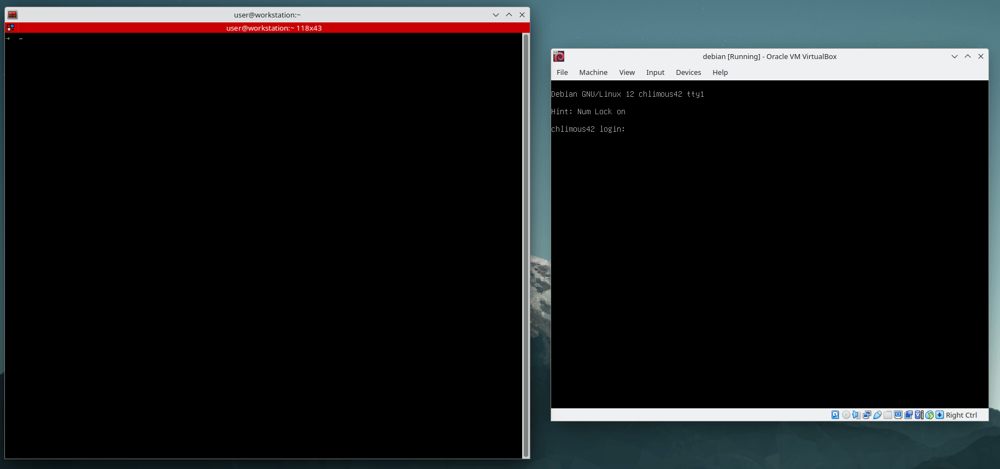

---

### ファイアウォール

SSHにログインしたら、``su -``と入力してrootユーザーに切り替えます。

サーバーのセキュリティを強化するために、UFW（Uncomplicated Firewall）を使用してファイアウォールを設定します。UFWはユーザーフレンドリーで、ファイアウォールルールを管理するのに効果的です。まずUFWをインストールしましょう:

``apt install ufw`` | UFWをインストールします。

``ufw default deny incoming`` | すべての着信リクエストをブロックします。

``ufw default allow outgoing`` | すべての発信リクエストを許可します。

``ufw allow 4242`` | ポート``4242``での着信トラフィックを許可します。これは、SSH経由でサーバーに引き続きアクセスできるようにするために重要です。

``ufw enable`` | UFWを有効にします。

---

### sudoとグループ

### sudo

sudoプログラムはLinuxにとって重要なツールであり、ユーザーがroot（または別のユーザー）の権限でコマンドを実行できるようにします。

インストールするには、次のように入力します: ``apt install sudo``

次に、sudoの設定を調整します。設定ファイルを開くには``visudo``と入力します。

次の行を追加します:

``Defaults secure_path="/usr/local/sbin:/usr/local/bin:/usr/sbin:/usr/bin:/sbin:/bin"`` | sudoがコマンドを実行するために使用できるパスを制限します。この設定はすでに存在し、そのままにしておくことができます。

``Defaults requiretty`` | sudoを使用するためにTTYが必要です。

``Defaults badpass_message="WRONG PASSWORD"`` | sudoで間違ったパスワードを使用したときにカスタムメッセージを表示します。

``Defaults logfile="/var/log/sudo/sudo.log"`` | 入力ログファイルを設定します。

``Defaults log_input`` | 入力をログに記録します。

``Defaults log_output`` | 出力をログに記録します。

``Defaults iolog_dir=/var/log/sudo`` | 追加の出力および入力ログを保存するディレクトリを設定します。

``Defaults passwd_tries=3`` | sudoを使用した接続試行回数を制限します。

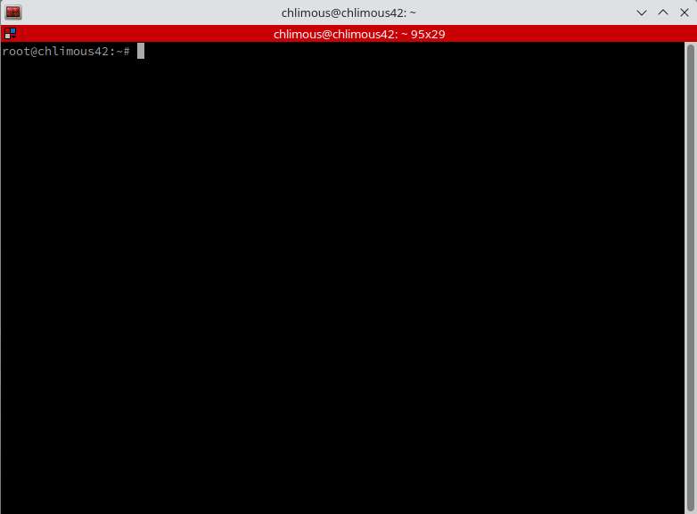

### グループ

born2berootの要件で指定されているように、ユーザーを``user42``および``sudo``グループに追加する必要があります。

``groupadd user42`` | ``user42``グループを追加します。

``usermod -a -G user42,sudo chlimous`` | ユーザー``chlimous``を``user42``および``sudo``グループに追加します。

変更を確認するには、``/etc/group``ファイルを確認できます: ``cat /etc/group``

これでユーザーがsudoグループに追加されたので、``sudo``を使用してコマンドを実行し、管理タスクを実行するための権限を昇格させることができます。

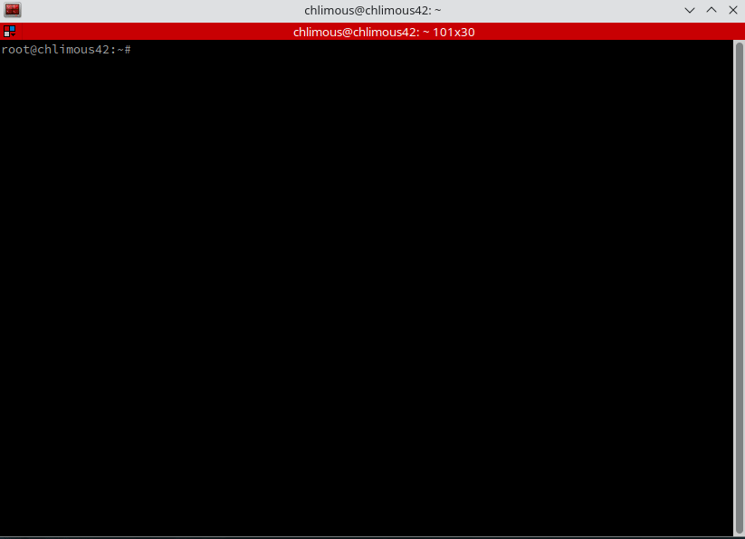

---

### パスワードポリシー

/etc/login.defs設定ファイルに移動し、次の行を変更します:

``PASS_MAX_DAYS 30`` | パスワードが30日ごとに期限切れになるようにします。

``PASS_MIN_DAYS 2`` | パスワードの変更前に必要な最小日数。

``PASS_WARN_AGE 7`` | パスワードの有効期限が切れる前に警告が表示される日数。これはそのままにしておくことができます。

次に、行ったポリシー変更が現在のユーザーに適用されるようにする必要があります:

``chage -M 30 chlimous`` | ユーザー``chlimous``の``PASS_MAX_DAYS``を``30``日に設定します。

``chage -m 2 chlimous`` | ユーザー``chlimous``の``PASS_MIN_DAYS``を``2``日に設定します。

これらの変更をユーザーアカウントとrootアカウントの両方に適用します。

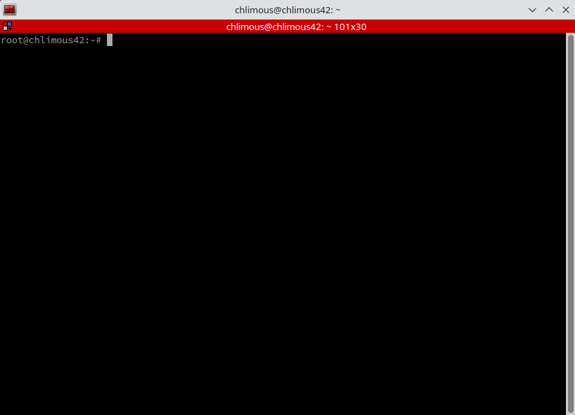

パスワードポリシーを強化するために、pwqualityというモジュールを利用します:

``apt install libpam-pwquality``

次に、``/etc/pam.d/common-password``設定ファイルにアクセスして、パスワードルールを設定します。

変更前:

``password requisite pam_pwquality.so retry=3``

変更後:

``password        requisite                       pam_pwquality.so retry=3 minlen=10 difok=7 maxrepeat=3 dcredit=-1 ucredit=-1 lcredit=-1 reject_username enforce_for_root``

詳細:

``retry`` | 間違った試行の最大回数。

``minlen`` | 新しいパスワードの最小許容サイズ。

``difok`` | 新しいパスワードに含まれてはならない、古いパスワードの文字数。enforce_for_rootが設定されていても、rootユーザーにはこのルールは適用されません（変更に古いパスワードは必要ないため）。

``maxrepeat`` | 新しいパスワードで許可される、同じ連続文字の最大数。

``dcredit`` | 新しいパスワードの最小桁数。（負の値）

``ucredit`` | 新しいパスワードの最小大文字数。（負の値）

``lcredit`` | 新しいパスワードの最小小文字数。（負の値）

``reject_username`` | 新しいパスワードにユーザー名を含めることはできません。

``enforce_for_root`` | ルールをrootに適用します。

新しいルールが適用されたら、ユーザーアカウントとrootアカウントの両方のパスワードを更新します:

``passwd chlimous`` | ユーザー``chlimous``のパスワードを変更します。

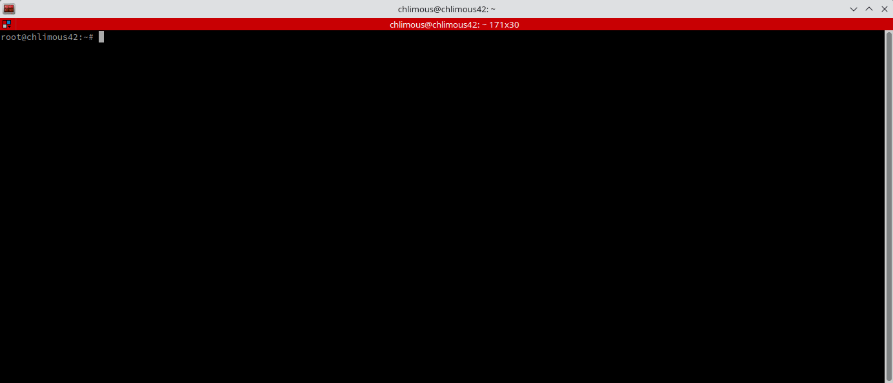

---

### 監視スクリプト

#### スクリプトの作成

[私のスクリプトを確認できます](monitoring.sh)が、この部分はカバーしません。RTFM DYOR 🤓

動作させるには、``bc``と``sysstat``が必要です:

``apt install bc sysstat``

#### Cronジョブ

cronプログラムを使用すると、設定されたスケジュールに基づいてバックグラウンドでスクリプトを自動的に実行できます。

cronジョブを追加するには、rootとしてcrontabファイルを編集します:

``crontab -e`` | このファイルでは、各行がcronジョブを表します。

``*/10 * * * * bash /etc/cron.d/monitoring.sh | wall`` | 10分ごとに、``cron``は``/etc/cron.d``にある``monitoring.sh``スクリプトを実行し、出力を``wall``にパイプします。

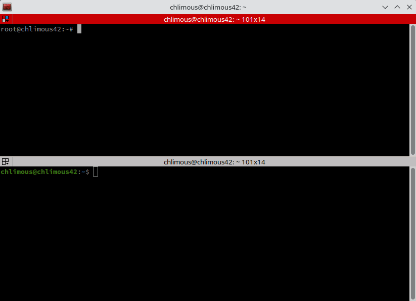

---

### Wordpressの設定

必須パートが終わったので、次はボーナスに注目しましょう。

#### パッケージのインストール

Wordpressを実行するには、Webサーバー、データベース管理システム、およびPHPが必要です。

``apt install lighttpd`` | lighttpd、超軽量Webサーバー。

``apt install mariadb-server`` | MariaDB、MySQLのフォーク。

``apt install php php-pdo php-mysql php-zip php-gd php-mbstring php-curl php-xml php-pear php-bcmath php-opcache php-json php-cgi`` | PHP本体および追加パッケージ。

#### ファイアウォールとPHPの有効化

WebサーバーでPHPを有効にするには、次のコマンドを入力します:

``lighttpd-enable-mod fastcgi fastcgi-php``

これに続いて、Webサーバーを再起動して変更を適用します: ``systemctl restart lighttpd``

また、先ほど説明したファイアウォールの設定を思い出してください。現在、ポート4242での着信リクエストのみが許可されています。HTTPリクエストに対応するには、ポート80を開く必要があります。

``ufw allow http``

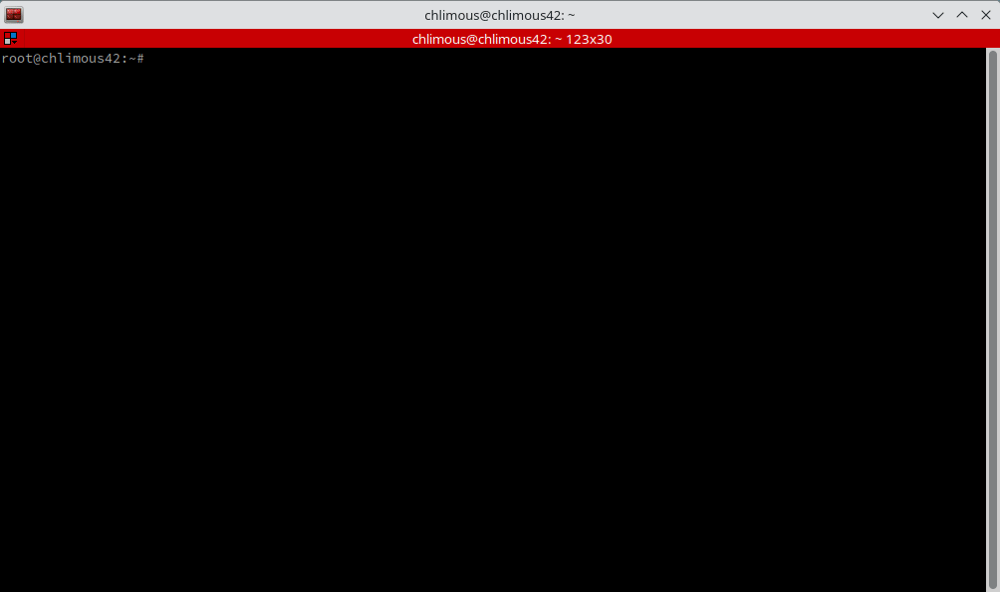

#### ポートフォワーディング

もう一度、Virtualboxでポートフォワーディングを設定する必要があります。

ホスト上の利用可能なポートからのリクエストをゲストポート80にリダイレクトするポートフォワーディングルールを確立します。

これで、Webサーバーは[127.0.0.1:1672](http://127.0.0.1:1672)でアクセスできるはずです（1672を選択したホストポートに置き換えてください）。

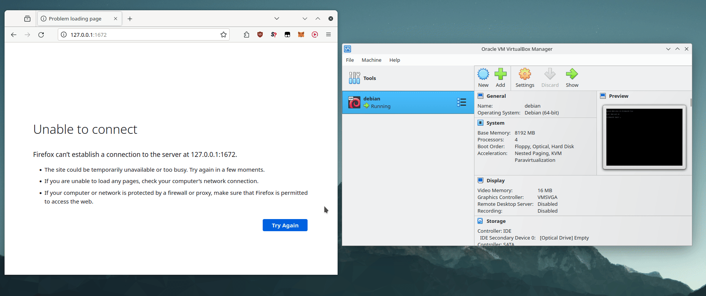

#### データベース

``mariadb``と入力してmariadbプロンプトにアクセスします。

次に、これを入力します:

``CREATE DATABASE chlimous_db;`` | ``chlimous_db``データベースを作成します。

``CREATE USER chlimous@localhost;`` | ユーザー``chlimous``を作成し、そのアクセスを``localhost``からのみデータベースに接続するように制限します。

``GRANT ALL PRIVILEGES ON chlimous_db.* TO chlimous@localhost;`` | ユーザー``chlimous``に、``localhost``ホスト上のデータベース``chlimous_db``内のすべてのテーブルに対する完全な権限を与えます。

``FLUSH PRIVILEGES;`` | 権限を更新します。

#### まとめ

追加する要素が1つ残っています: Wordpress。

Webサーバーのルートである``/var/www/html/``に移動します。このディレクトリ内の既存のファイルを削除します: ``rm *``

``wget https://wordpress.org/latest.tar.gz`` | Wordpressの最新バージョンをダウンロードします。

``tar xvf *.tar.gz && rm *.tar.gz`` | アーカイブを展開し、削除します。

``mv wordpress/* . && rm -r wordpress`` | Wordpressファイルをルートディレクトリに移動し、空のWordpressディレクトリを削除します。

``chown -R www-data:www-data /var/www/html/`` | ``/var/www/html/``ディレクトリの所有権を``www-data``に変更します。この手順は、Webサーバーが正しく機能するために必要です。

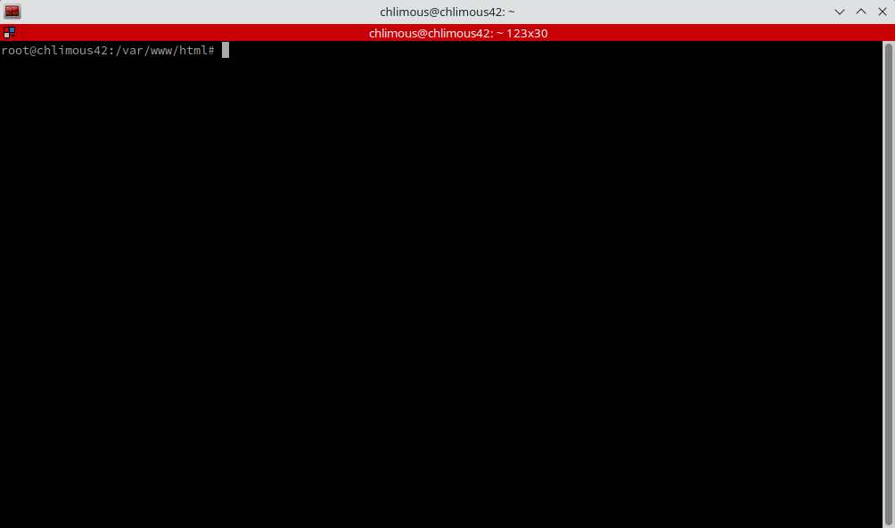

[127.0.0.1:1672](http://127.0.0.1:1672)に戻ります。これでWordpressにアクセスできますが、まずデータベースアクセスを設定する必要があります。インストールプロセスは簡単です：言語を選択し、データベース名とユーザー認証情報を入力するだけです。あなたのウェブサイトは準備完了です。

---

### 追加サービス

#### 何を選ぶか？

ホスティングサービスの可能性は無限です。

始めるためのいくつかの提案を以下に示します:

- 生成AI (Stable Diffusion)
- 監視 (Prometheus)
- データ可視化ツール (Grafana)
- ファイナンス (Ghostfolio)
- ERP/CRM (Odoo)
- ビジネスインテリジェンス (Metabase)
- コラボレーションスイート (CryptPad)
- ブロックチェーンノード (Bitcoin Core)
- パスワードマネージャー (Vaultwarden)
- 動画ダウンローダー (MeTube)
- メディアサーバー (Jellyfin)
- ゲームサーバー (Minecraft)
- ファイルストレージ (Nextcloud)
- 動画ストリーミング (Peertube)
- 電子書籍コレクションマネージャー (Calibre)
- 音楽コレクションマネージャー (Lidarr)
- 写真アプリケーション (PhotoPrism)
- 翻訳 (LibreTranslate)
- アナリティクス (Matomo)
- スピードテスト (LibreSpeed)
- コンテナユーティリティ (Docker)
- ホスティングパネル (Cloudron)
- 自動化 (n8n)
- Torrent (qBittorrent)
- IDE (Visual Studio Code Server)
- ソーシャルプラットフォーム (Revolt)
- チャット (Rocket.Chat)
- Pastebin (Hastebin)
- フローチャートメーカー (draw.io)
- VPN (WireGuard)
- VOIP / ビデオ会議 (Jitsi)
- ノートテイキング (Standard Notes)
- Gitサーバー (Gitlab)
- CMS (Ghost)
- フォーラム (Discourse)
- RSSアグリゲーター (FreshRSS)
- サーバーダッシュボード (Organizr)

...など、リストは続きます。

#### Netdataの設定

私はPrometheus/Grafanaの流れを汲むオープンソースの監視サービスであるNetdataを選びました。

``apt install netdata``

Netdataはポート19999で動作するため、このポートを開く必要があります: ``ufw allow 19999``

起動時にすでに有効になっています。確認するには次のように入力します: ``systemctl is-enabled netdata``

最後に、未使用のホストポートからゲストポート19999へのポートフォワーディングを設定します。この時点までには、その仕組みに慣れているはずです！私はホストポートとして1372を使用しました。

``etc/netdata/netdata.conf``ファイルでIPアドレスを0.0.0.0に変更する必要があるかもしれません。

これらの設定により、Netdataは[127.0.0.1:1372](http://127.0.0.1:1372)でアクセスできるはずです。

---

### 署名とスナップショット

このborn2berootガイドの最後になりますが、.vdiファイルのハッシュを生成する必要があります。これにより、プロジェクトの終了からその後の評価までの間、仮想マシンが変更されないことが保証されます。

まず、ゲストマシンをシャットダウンし、Virtualboxでスナップショットを取得します。この手順により、その後システムに大きな変更が加えられた場合でも、いつでもスナップショットでキャプチャされた正確な状態に戻すことができます。各評価の前に必ずこのスナップショットを使用してください。

仮想マシンを含むディレクトリに移動します。

``sha1sum debian.vdi`` | ``debian.vdi``ファイルのSHA-1ハッシュを生成します。

このプロセスには時間がかかる可能性があることに注意してください。仮想ディスクのサイズが大きいほど、ハッシュ署名の生成に時間がかかります。

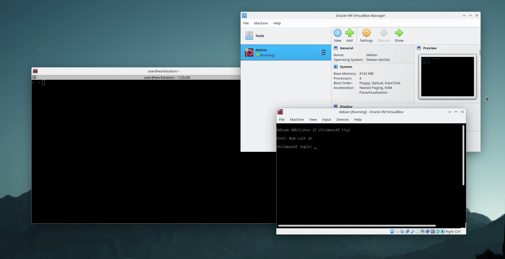

### その他

工事中
